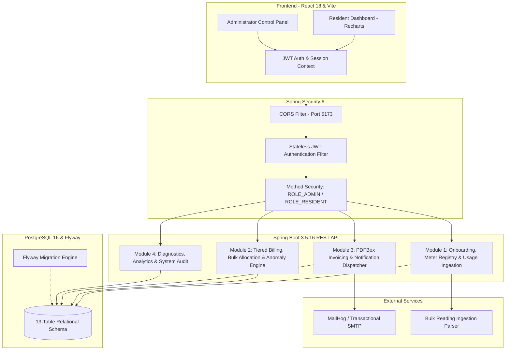
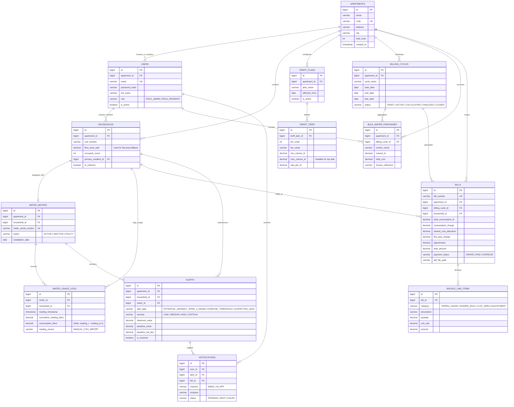

# Development of a Smart Water Usage Monitoring and Automated Billing Management Platform

[](https://spring.io/projects/spring-boot)
[](https://openjdk.org/)
[-blue.svg?logo=springsecurity)](https://spring.io/projects/spring-security)
[](https://www.postgresql.org/)
[](https://react.dev/)
[](https://vitejs.dev/)
[](https://pdfbox.apache.org/)
[](#team-allocation)
[](https://infyspringboard.onwingspan.com/)

---

## 1. Executive Summary & Overview

The **Smart Water Usage Monitoring and Automated Billing Management Platform** is a full-stack, enterprise-grade IoT telemetry and utility billing solution engineered for multi-family residential communities and apartment complexes. 

Rapid urbanization and climate pressure have made equitable water management in residential societies a major urban challenge. Most apartment complexes suffer from:
1. **Inequitable flat-rate billing**, where low-consumption single occupants subsidize heavy consumers.
2. **Unaccounted bulk water procurement**, where high-cost private water tanker deliveries are arbitrarily distributed without reconciling metered consumption.
3. **Undetected pipe bursts and slow leaks**, causing staggering physical losses and unexpected spikes in monthly utility bills.
4. **Opaque and disputed manual paper bills**, lacking clear line-item transparency.

This platform centralizes daily water consumption logging, automates multi-tier progressive tariffs, reconciles external bulk water purchases, distributes shared overhead proportionally, detects consumption anomalies using statistical deviation rules ($> 2\sigma$), and generates legally compliant, itemized PDF invoices alongside real-time resident dashboards.

---

## 2. Core Architecture & System Flow

The platform is designed as a modular monorepo containing a stateless Spring Boot 3 REST API backend and a responsive React.js single-page application (SPA):



---

## 3. Four Original Modules & Functional Scope

The platform strictly adheres to the four functional modules defined in the project specification:

### Module 1: Apartment & Household Schema, Water Usage Logging & Core REST APIs (Weeks 1–2)
- **Database Schema & Migrations:** 13 relational tables initialized with version-controlled Flyway DDL scripts.
- **Identity & Access Management:** Spring Security 6 stateless JWT authentication, BCrypt password hashing, and role-based access control (`ROLE_ADMIN`, `ROLE_RESIDENT`).
- **Apartment & Resident Onboarding:** Complex registration, household profile creation with registered floor area (sq. ft.), and resident occupancy mapping.
- **Water Meter Lifecycle Management:** Hardware serialization and status tracking (`ACTIVE`, `INACTIVE`, `FAULTY`).
- **Telemetry & Reading Ingestion:**
  - Single manual daily meter reading API.
  - Bulk CSV upload endpoint with automated delimiter parsing and error reporting.
  - Strict input validation: monotonic counter checks ($\text{reading}_t \ge \text{reading}_{t-1}$) and duplicate detection via composite unique constraint on `(meter_id, reading_timestamp)`.
- **Initial Test Suite:** Unit testing with JUnit 5/Mockito and MockMvc slice integration tests.

### Module 2: Billing Engine, Consumption Distribution & Alert System (Weeks 3–4)
- **Billing Cycle Lifecycle:** Automated cycle management (`DRAFT` $\rightarrow$ `ACTIVE` $\rightarrow$ `CALCULATING` $\rightarrow$ `FINALIZED` $\rightarrow$ `CLOSED`).
- **Configurable Tiered Tariffs:** Progressive slab pricing linked to each apartment (e.g., Tier 1: 0–10 kL @ base rate; Tier 2: $>10$ kL @ higher rate).
- **Bulk Water Purchase Tracking:** Commercial procurement ledger recording tanker vendor, volume (kL), and purchase cost per billing cycle.
- **Dual-Path Cost Allocation Engine:**
  - **Metered Households:** Billed for tiered metered volume + proportional share of bulk water transmission/deficit.
  - **Unmetered Households (Flat-Area Fallback):** Residual bulk cost allocated based on household floor area ratio:
    $$\text{FlatAreaCost}_k = C_{\text{unmetered\_pool}} \times \frac{\text{FloorArea}_k}{\sum \text{FloorArea}_{\text{unmetered}}}$$
- **Statistical Anomaly Detection Engine ($>2\sigma$ Rule):**
  - Scheduled background worker calculating rolling 30-day mean ($\mu$) and standard deviation ($\sigma$).
  - Flags readings where $\text{daily\_usage} > \mu + 2\sigma$ as **Potential Anomaly / Spike Warnings** (rather than unverified mechanical leaks).
  - Cold-start handling for newly registered households ($N < 7$ days cohort median, $7 \le N < 14$ days preliminary baseline).
- **Overuse Alerts:** Threshold limit notifications for continuous excessive consumption.

### Module 3: React.js Resident Dashboard, Admin Panel & Invoice Generation (Weeks 5–6)
- **Resident Portal:** Responsive UI displaying real-time water usage, estimated monthly bill, historical invoices, and active anomaly banners.
- **Administrator Operations Panel:** Community water audit dashboard (Bulk Inflow vs. Metered Sum = Distribution Loss/Leakage), meter registry, tariff plan manager, CSV upload GUI, and one-click billing cycle execution.
- **Recharts Visualizations:** Time-series daily consumption line charts, month-over-month bar charts, and peer distribution curves.
- **Household Benchmarking:** Anonymous comparative analytics (e.g., *"Your household consumed 18% less water than average 3-BHK units this month"*).
- **Programmatic PDF Invoices:** Built using **Apache PDFBox 3.0.3**, generating immutable, itemized invoice PDFs detailing base usage, shared allocations, flat-area charges, adjustments, and payment QR codes.
- **Transactional Notifications:** Automated dispatch via Spring Mail and Thymeleaf HTML templates for new bills and anomaly alerts.

### Module 4: System Integration, Testing & Project Finalization (Weeks 7–8)
- **End-to-End Module Integration:** Full workflow verification from CSV usage upload to invoice generation and resident viewing.
- **Edge-Case Hardening:** Verification of meter replacement resets, leap periods, unmetered transitions, and zero-consumption units.
- **Performance & Concurrency Testing:** JMeter / k6 load testing simulating concurrent CSV uploads and bulk billing runs.
- **Cross-Browser & Responsive QA:** Cross-platform validation on Chrome, Firefox, Safari, Edge, and mobile viewports.
- **Documentation & OpenAPI:** Production OpenAPI 3.0 documentation (`/swagger-ui.html`).
- **Docker Compose Deployment:** Multi-container production orchestration for PostgreSQL 16, backend API, frontend SPA, and MailHog.
- **Final Presentation Deliverables:** Project documentation, slide deck (PPT), and live demonstration rehearsal.

---

## 4. Eight-Week Milestone Delivery Roadmap

| Milestone | Target Weeks | Core Deliverables & Capabilities | Verification Artifacts |
| :--- | :--- | :--- | :--- |
| **Milestone 1** | **Weeks 1–2** | Schema DDL, Spring Security 6 JWT, Apartment Onboarding, Meter Registry, Usage Logging, CSV Upload & Validation. | Passing unit & MockMvc integration tests; Flyway scripts. |
| **Milestone 2** | **Weeks 3–4** | Configurable Tiered Tariffs, Bulk Water Accounting, Proportional & Flat-Area Billing Engine, $>2\sigma$ Anomaly Engine, Billing Cycles. | Billing calculation verification suites, math precision tests. |
| **Milestone 3** | **Weeks 5–6** | React Resident Dashboard, Admin Control Panel, Recharts Visuals, Apache PDFBox Invoice Engine, Spring Mail Dispatcher. | Functional UI flows, sample PDF invoices, test emails in MailHog. |
| **Milestone 4** | **Weeks 7–8** | End-to-End System Integration, JMeter/k6 Load Testing, Responsive Mobile QA, Docker Compose Guide, Final Report & PPT. | Load test performance logs, OpenAPI docs, Docker deployment, Demo video. |

---

## 5. Database Architecture (13-Table Schema)

The database schema models all aspects of multi-tenant apartment water monitoring, procurement, and billing across **13 tables**:



### Key Relational Constraints & Indexes
1. **Duplicate Prevention:** Composite unique constraint on `(meter_id, reading_timestamp)` in `water_usage_logs`.
2. **Single Bill Guarantee:** Composite unique constraint on `(billing_cycle_id, household_id)` in `bills`.
3. **Apartment Isolation:** Composite unique constraint on `(apartment_id, unit_number)` in `households`.
4. **Billing Period Integrity:** Composite unique constraint on `(apartment_id, start_date, end_date)`.
5. **High-Frequency Query Indexes:** B-Tree indexes on `(household_id, reading_timestamp DESC)` for high-speed dashboard analytics.

---

## 6. Accounting Rules & Double-Counting Prevention

To ensure mathematical precision, compliance with community accounting standards, and eliminate double-counting, the billing calculation follows a strict sequence:

```
┌───────────────────────────────────────────────────────────────────────────────────┐
│                          BILLING ENGINE CALCULATION PIPELINE                      │
├───────────────────────────────────────────────────────────────────────────────────┤
│  STEP 1: Metered Household Consumption & Tiered Charges                           │
│          • Compute individual household delta: V_i = EndReading - StartReading    │
│          • Apply ordered Tariff Tiers (e.g. 0-10 kL @ R1, >10 kL @ R2)            │
│          • Result: TieredCharge_i                                                 │
│                                                                                   │
│  STEP 2: Bulk Purchase Cost Pool Aggregation                                      │
│          • Aggregate total bulk water purchase cost: C_bulk = Sum(Cost)           │
│                                                                                   │
│  STEP 3: Partitioning into Non-Overlapping Shared Pools                           │
│          • Split C_bulk into C_bulk_metered and C_bulk_unmetered                  │
│          • Ensures no dollar of procurement is assigned to both pools             │
│                                                                                   │
│  STEP 4: Dual-Path Distribution                                                   │
│          • Metered Households: Allocated proportionally to metered usage          │
│          • Unmetered Households: Flat-Area Fallback based on floor area ratio     │
│                                                                                   │
│  STEP 5: Adjustments, Totaling & Rounding Discrepancy Reconciliation              │
│          • Add credits / arrears / penalties                                      │
│          • Apply Banker's Rounding (HALF_EVEN) with penny reconciliation          │
│          • Guarantee: Sum(AllocatedBills) == C_target                             │
└───────────────────────────────────────────────────────────────────────────────────┘
```

### Charge Component Definitions
1. **Tiered Usage Charge ($\text{TieredCharge}_i$):**
   - Applies only to metered households based on individual consumption ($V_i$).
   - Calculated via progressive slabs (e.g., Tier 1: 0–10 kL @ $R_1$; Tier 2: $>10$ kL @ $R_2$):
     $$\text{TieredCharge}_i = \sum_{t=1}^{T} \max\left(0, \min(V_i, \text{TierMax}_t) - \text{TierMin}_t\right) \times \text{Rate}_t$$
   - Unmetered units do not have meters; this charge component is $0$.

2. **Shared Bulk Water Allocation ($\text{SharedCost}_i$):**
   - Metered units receive an allocation of the metered bulk water pool proportional to their actual usage:
     $$\text{SharedCost}_i = C_{\text{bulk\_metered}} \times \frac{V_i}{\sum_{j \in \text{Metered}} V_j}$$

3. **Flat-Area Fallback ($\text{FlatAreaCost}_k$):**
   - Unmetered units have no meters to measure consumption. Their water cost is derived from the unmetered bulk water pool allocated strictly by registered floor area:
     $$\text{FlatAreaCost}_k = C_{\text{bulk\_unmetered}} \times \frac{\text{FloorArea}_k}{\sum_{m \in \text{Unmetered}} \text{FloorArea}_m}$$

### Prevention of Double-Counting
Bulk water purchases represent external tanker water brought into the community storage tanks to meet demand.
- The cost pool $C_{\text{bulk}}$ is partitioned into disjoint sectors ($C_{\text{bulk\_metered}} + C_{\text{bulk\_unmetered}} = C_{\text{bulk}}$).
- Metered households only pay `TieredCharge` + `SharedCost`.
- Unmetered households only pay `FlatAreaCost`.
- Each charge represents an independent, distinct line item in `invoice_line_items`.
- **Exact Conservation of Funds:**
  $$\sum_{i \in \text{Metered}} \text{SharedCost}_i + \sum_{k \in \text{Unmetered}} \text{FlatAreaCost}_k \equiv C_{\text{bulk}}$$

### Rounding Discrepancy Reconciliation (Penny Conservation)
- Intermediate arithmetic uses `BigDecimal` with 6 decimal places and `HALF_EVEN` (Banker's rounding).
- Line items are rounded to 2 decimal places (`HALF_UP`).
- Any fractional cent/paise discrepancy across the apartment pool ($\Delta = C_{\text{target}} - \sum \text{Allocated}$) is assigned to the household with the largest allocation fraction, ensuring the sum of all distributed bills matches the total cost pool down to the penny.

---

## 7. Statistical Anomaly Detection Engine ($>2\sigma$ Rule)

The anomaly detection engine evaluates consumption spikes without jumping to false conclusions:

- **Classification:** An occurrence where $X_t > \mu + 2\sigma$ is recorded as `POTENTIAL_ANOMALY_SPIKE_2_SIGMA` or `SUSPECTED_LEAK`. It is treated as an investigation alert rather than a confirmed mechanical failure.
- **Statistical Rule:**
  $$\text{Anomaly Condition: } X_t > \mu_{\text{household}} + 2 \times \sigma_{\text{household}}$$
  where $\mu$ is the rolling 30-day mean of daily consumption and $\sigma$ is the standard deviation.
- **Handling Insufficient Historical Data (Cold-Start Strategy):**
  - **$N < 7$ Days:** The engine cannot calculate a reliable standard deviation. It compares against the **Apartment Cohort Median** for households with the same occupancy count ($\mu_{\text{cohort}} + 2\sigma_{\text{cohort}}$).
  - **$7 \le N < 14$ Days:** Evaluated with a wider safety margin ($> 2.5\sigma$) and flagged with `PRELIMINARY_BASELINE`.
  - **$N \ge 14$ Days:** The full individual household $>2\sigma$ statistical evaluation activates automatically.

---

## 8. Technology Stack & Compatibility Matrix

| Component | Technology | Version | Rationale & Compatibility |
| :--- | :--- | :--- | :--- |
| **Runtime** | Java OpenJDK | **17 LTS** | Matches host environment (`Temurin-17.0.19`). Baseline for Spring Boot 3. |
| **Backend Framework** | Spring Boot | **3.5.16** | Satisfies project specification requiring Spring Security 6. *(Reached EOL June 2026).* |
| **Security & Auth** | Spring Security 6 / JJWT | Managed / **0.12.6** | Stateless JWT authentication, BCrypt, RBAC (`ADMIN`, `RESIDENT`). |
| **Database Engine** | PostgreSQL | **16 (Alpine Container)** | Relational engine with time-series statistical window functions. |
| **Migrations** | Flyway | **11.7.2 (Managed)** | Version-controlled DDL migrations with `flyway-database-postgresql`. |
| **PDF Invoices** | Apache PDFBox | **3.0.3** | Apache 2.0 open-source programmatic PDF generation. |
| **Frontend Framework** | React.js (via Vite) | **18.3.1 (Vite 5.4)** | React 18 LTS; fully compatible with Recharts and Axios. |
| **Visualizations** | Recharts | **2.12.7** | Interactive consumption series and peer benchmarking. |
| **API Documentation** | SpringDoc OpenAPI | **2.8.5** | OpenAPI 3.0 Swagger UI for Spring Boot 3.5. |
| **Validation** | Jakarta Bean Validation | Managed | Hibernate Validator 8 DTO constraint validation. |
| **Testing** | JUnit 5 / Mockito / MockMvc | Managed | Comprehensive unit, repository, and controller slice integration testing. |

---

## 9. Security & Secrets Management Strategy

1. **Zero Secrets in Version Control:** The `.env` file is excluded via `.gitignore`. The repository only tracks `.env.example` with safe dummy placeholders.
2. **Fail-Fast Boot Enforcement:** Spring Boot is configured without a static fallback for `JWT_SECRET`. If `JWT_SECRET` is unset or blank in the active environment, the application immediately throws an exception on startup rather than running with an insecure default.
3. **Secure Key Generation:**
   ```powershell
   # Windows PowerShell 256-bit Base64 Key Generator
   [Convert]::ToBase64String((1..32 | ForEach-Object { Get-Random -Minimum 0 -Maximum 256 }))
   ```

---

## 10. Suggested Team Allocation (Code_Crew)

- **Member 1 (Backend & Security Lead):** Spring Boot architecture, Spring Security 6, JWT filters, REST controllers, API contracts.
- **Member 2 (Database & Billing Lead):** PostgreSQL, Spring Data JPA, Flyway migrations, tiered tariff engine, bulk purchase allocation, rounding reconciliation.
- **Member 3 (Resident Experience Frontend):** React resident portal, Recharts daily/monthly trends, bill breakdown UI, mobile responsiveness.
- **Member 4 (Admin Panel & Anomaly Lead):** Administrator dashboard, CSV upload interface, $>2\sigma$ anomaly detection engine, Apache PDFBox invoice generation, Spring Mail integration.

---

## 11. Quickstart & Local Setup Guide

### Prerequisites
- Java 17 LTS (`java -version`)
- Node.js 18+ and npm (`node -v`, `npm -v`)
- Apache Maven (or use bundled `.\mvnw.cmd` / `./mvnw`)
- Docker Desktop or a local PostgreSQL 16 instance

### 1. Configure Environment
```bash
# Clone the repository
git clone https://github.com/prajwalpr4/Development-of-a-Smart-Water-Usage-Monitoring-and-Automated-Billing-Management-Platform.git
cd Development-of-a-Smart-Water-Usage-Monitoring-and-Automated-Billing-Management-Platform

# Copy template to .env
cp .env.example .env
```
Generate your 256-bit base64 secret using PowerShell or `openssl rand -base64 32` and paste it into `JWT_SECRET` inside `.env`.

### 2. Start PostgreSQL & MailHog (via Docker Compose)
```bash
docker compose up -d
```
- PostgreSQL: `localhost:5432`
- MailHog Web UI: `http://localhost:8025`

### 3. Run Backend (Spring Boot 3.5.16)
```bash
cd backend
./mvnw clean spring-boot:run
# Windows PowerShell:
# .\mvnw.cmd clean spring-boot:run
```
- REST Health Endpoint: `http://localhost:8080/api/v1/health`
- Swagger UI / OpenAPI Docs: `http://localhost:8080/swagger-ui.html`

### 4. Run Frontend (React 18 & Vite)
```bash
cd ../frontend
npm install
npm run dev
```
- Open browser: `http://localhost:5173`

---

## 12. Current Development Status & Foundation Verification

The **Foundation Milestone** has been implemented, validated, and verified:

```
[✓] Backend ApplicationContext startup: PASSED
[✓] Spring Security 6 stateless filter chain: VERIFIED
[✓] Diagnostic Health REST API (/api/v1/health): ACTIVE & TESTED
[✓] MockMvc slice test suite (3/3 tests): 100% PASSING
[✓] Frontend React 18 / Vite compilation: 1621 modules transformed into dist/ in 4.25s
[✓] Frontend dev server: READY on http://localhost:5173
[✓] Zero hardcoded credentials policy: ENFORCED
```

---

## 13. Judge Demonstration Walkthrough (5–7 Minutes)

1. **Context (1 min):** Present the problem of unfair flat-rate water billing and undetected leaks in residential communities.
2. **Resident Journey (2 mins):** Log into the Resident Portal, review daily usage curves in Recharts, inspect estimated tiered bills, and examine peer benchmarking.
3. **Admin Operations (2 mins):** Log into the Admin Panel, upload a bulk meter reading CSV, demonstrate instantaneous duplicate rejection, inspect community bulk water accounting, and trigger a billing cycle run.
4. **Anomaly Flagging (1 min):** Trigger an anomalous reading spike $> 2\sigma$ and demonstrate the real-time alert and notification dispatch.
5. **Invoice Inspection (1 min):** Download the Apache PDFBox-generated invoice showing itemized tiered usage, proportional bulk allocation, and flat-area fallback.

---

## 14. License & Credits

Developed by **Team Code_Crew** under the **Infosys Springboard Project 2026**.  
Released under the [MIT License](LICENSE).
